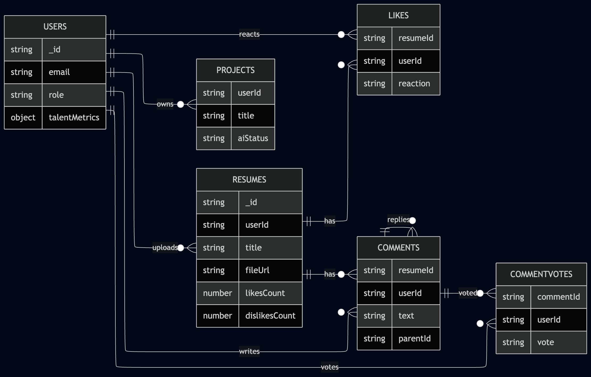
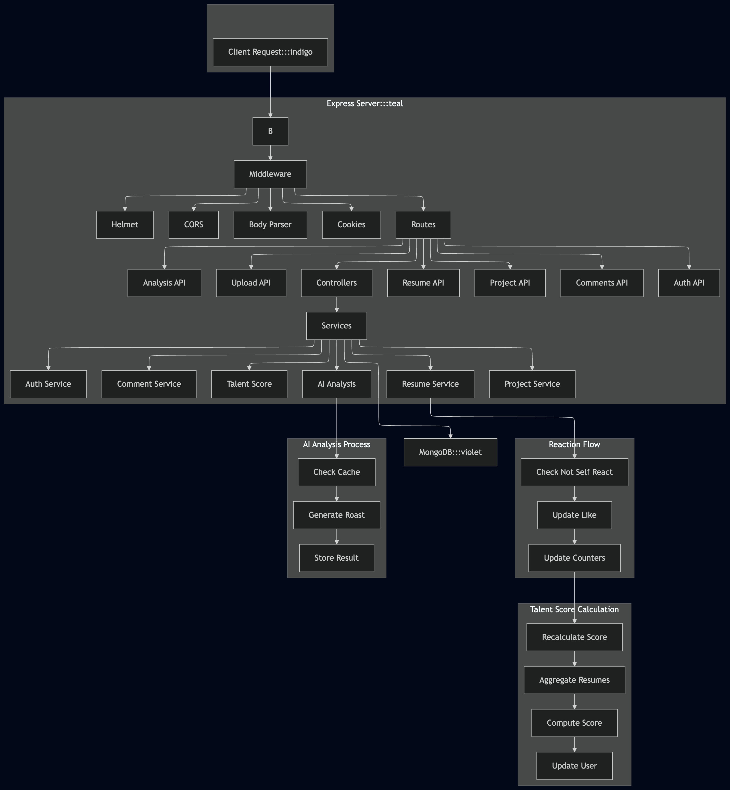
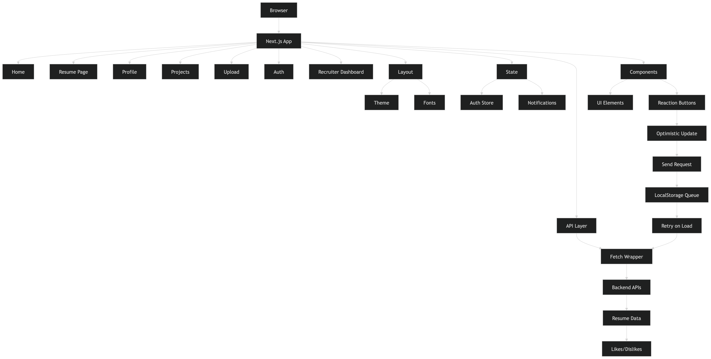

# RoastForge

RoastForge is a full-stack app where people upload resumes (and side projects), get an AI “roast” with a score, and hear from the community through comments, votes, and thumbs up or down. Recruiters get a separate lane to search candidates and open a structured profile view. The stack is intentionally boring on purpose: Express + MongoDB on the server, Next.js on the client, so the interesting parts stay in the product—not the plumbing.

## Monorepo layout

- **[backend](backend)** — Express 5 + TypeScript API, Mongoose, JWT cookies, Cloudinary uploads, Google GenAI for analysis  
- **[frontend](frontend)** — Next.js App Router, Tailwind, shared UI primitives, central `api` client

## Architecture (at a glance)

These diagrams live in [`docs/architecture/`](docs/architecture/) as PNGs if you want to drop them into slides or a wiki. Below they’re inlined so anyone cloning the repo can orient themselves without opening a design tool.

### Data model

Resumes sit in the middle: they belong to a user, collect reactions (`likes` collection—one row per viewer per resume with `reaction: "like" | "dislike"`), and anchor threaded comments and comment votes. Projects are a parallel track for the same user. The user document holds a **derived** `talentMetrics.composite` score that the backend recomputes when resumes or reactions change—not something you edit by hand.



### Backend pipeline

A request hits Express, walks security and parsing middleware, then fans out to route modules. Controllers stay thin; services own the rules (who may react, how counters stay consistent, when to recalc talent score). Reactions update the `Like` document and the resume’s `likesCount` / `dislikesCount` in an atomic way; a separate pass aggregates that user’s resumes to refresh `User.talentMetrics.composite`. AI roast flows are similar: check cache hash, call the model if needed, persist `aiRoast` on the resume.



### Frontend pipeline

The App Router wraps pages in shared layout (theme tokens, fonts). Client pages call the same fetch wrapper with credentials, keep auth in a small store, and use toasts for feedback. Like/dislike controls optimistically update the UI, then confirm with `POST /api/resumes/:id/reaction`. If the network disappears, a tiny localStorage queue remembers the last intent per resume and flushes when you’re back online—without blocking the rest of the app.



## What’s implemented

### Backend

- JWT auth: register, login, refresh, logout, `me` (plus Google-oriented auth pieces where wired)
- Profile and identity: update profile, regenerate anonymous handle, account deletion with cascade cleanup
- Resumes: CRUD, pagination, text search, sort tabs, public vs owner-only fields (AI roast hidden from non-owners on public routes)
- Reactions: `POST /api/resumes/:id/reaction` with `like` / `dislike` and toggle semantics; legacy `POST .../like` still toggles a like
- Denormalized `likesCount` / `dislikesCount` on each resume; source of truth for *your* reaction is the `likes` collection
- **Talent score:** `User.talentMetrics.composite` is recomputed from the owner’s resumes—average AI score, plus a small bonus from total likes and a capped penalty from total dislikes (recruiters skipped)
- Comments: threads, replies, voting
- Uploads: resume + avatar via Cloudinary
- Analysis: AI roast endpoint with caching via `roastHash`
- **PII detection:** hybrid — links, emails, and phone numbers are found client-side from deterministic patterns plus real PDF hyperlink annotations (so linked text is editable regardless of what it says); name and location, which have no reliable pattern, come from `POST /api/analysis/detect-pii` (Gemini). If that call fails the editor still highlights everything found locally
- Projects module with optional AI evaluation
- Recruiter search and candidate profile endpoints
- MongoDB + Mongoose, validation, centralized errors, CORS + cookies, `GET /health`

### Frontend

- Next.js App Router with `(roasthub)` route group: gallery, resume detail, profile, projects, upload, auth, onboarding, recruiter views
- Design system: CSS variables for light/dark, typography (sans / heading / mono where it helps readability)
- Resume gallery and detail with **like / dislike** controls, optimistic UI, offline queue for reactions
- Comments, uploads, recruiter dashboard flows
- Shared components (buttons, dialogs, badges, etc.) and `lib/api` client with refresh handling
- Global auth store

## Project structure

```text
backend/
├── server.ts
├── env.example
├── src/
│   ├── app.ts
│   ├── common/
│   │   ├── config/
│   │   ├── dto/
│   │   ├── middleware/
│   │   └── utils/
│   └── modules/
│       ├── analysis/
│       ├── auth/
│       ├── comment/
│       ├── project/
│       ├── recruiter/
│       ├── resume/
│       └── upload/

docs/
└── architecture/
    ├── data-model.png
    ├── backend-pipeline.png
    └── frontend-pipeline.png

frontend/
├── src/
│   ├── app/
│   │   └── (roasthub)/
│   ├── components/
│   ├── hooks/
│   ├── lib/
│   └── store/
```

## Dependencies

Lists below are generated from the lockfiles’ package manifests—trim or expand in PRs when you add packages.

### Backend runtime

`@google/genai`, `@upstash/ratelimit`, `@upstash/redis`, `bcryptjs`, `cloudinary`, `cookie-parser`, `cors`, `dotenv`, `express`, `express-rate-limit`, `google-auth-library`, `helmet`, `joi`, `jsonwebtoken`, `mongoose`, `multer`, `nanoid`, `pdf-parse`

Source: [backend/package.json](backend/package.json)

### Backend development

`@types/bcryptjs`, `@types/cookie-parser`, `@types/cors`, `@types/express`, `@types/jsonwebtoken`, `@types/multer`, `@types/node`, `nodemon`, `ts-node`, `tsx`, `typescript`

Source: [backend/package.json](backend/package.json)

### Frontend runtime

`@base-ui/react`, `@radix-ui/react-avatar`, `@radix-ui/react-dialog`, `@radix-ui/react-dropdown-menu`, `@radix-ui/react-label`, `@radix-ui/react-separator`, `@radix-ui/react-slot`, `@radix-ui/react-tabs`, `@react-oauth/google`, `class-variance-authority`, `clsx`, `framer-motion`, `lucide-react`, `next`, `react`, `react-dom`, `react-icons`, `sonner`, `tailwind-merge`

Source: [frontend/package.json](frontend/package.json)

### Frontend development

`@tailwindcss/postcss`, `@types/node`, `@types/react`, `@types/react-dom`, `eslint`, `eslint-config-next`, `tailwindcss`, `typescript`

Source: [frontend/package.json](frontend/package.json)

## API routes

### Health

- `GET /health`

### Auth

- `POST /api/auth/register`
- `POST /api/auth/login`
- `POST /api/auth/refresh`
- `POST /api/auth/logout`
- `GET /api/auth/me`
- `PATCH /api/auth/me/profile`
- `PATCH /api/auth/regenerate-username`
- `DELETE /api/auth/account`

### Resumes

- `GET /api/resumes`
- `GET /api/resumes/my`
- `GET /api/resumes/:id`
- `POST /api/resumes`
- `PUT /api/resumes/:id`
- `DELETE /api/resumes/:id`
- `POST /api/resumes/:id/like` — legacy toggle-like
- `POST /api/resumes/:id/reaction` — body: `{ "reaction": "like" | "dislike" }` (toggle / switch semantics)

### Comments

- `GET /api/comments/resume/:resumeId`
- `POST /api/comments/resume/:resumeId`
- `PUT /api/comments/:id`
- `DELETE /api/comments/:id`
- `POST /api/comments/:id/replies`
- `POST /api/comments/:id/vote`

### Upload

- `POST /api/upload/resume`
- `POST /api/upload/avatar`

### Analysis

- `POST /api/analysis/:id`

### Project

- `GET /api/project`
- `POST /api/project`
- `DELETE /api/project/:id`

### Recruiter

- `GET /api/recruiter/candidates`
- `GET /api/recruiter/candidate/:userId/profile`

## Environment variables

Template: [backend/env.example](backend/env.example)

### Backend (typical)

- `PORT`, `NODE_ENV`, `MONGODB_URI`
- `JWT_ACCESS_SECRET`, `JWT_REFRESH_SECRET`, `JWT_ACCESS_EXPIRES_IN`, `JWT_REFRESH_EXPIRES_IN`
- `CLOUDINARY_CLOUD_NAME`, `CLOUDINARY_API_KEY`, `CLOUDINARY_API_SECRET`
- `UPSTASH_REDIS_REST_URL`, `UPSTASH_REDIS_REST_TOKEN`
- `GOOGLE_AI_KEY` (and any Google OAuth vars your auth flow expects)
- `UPLOAD_MAX_BYTES`, `FRONTEND_ORIGIN`, `CROSS_SITE_COOKIES`

### Frontend

- `NEXT_PUBLIC_API_URL` — origin of the API (e.g. `http://localhost:5000`)

## Local setup

1. **Backend deps**

   ```bash
   cd backend
   npm install
   ```

2. **Backend env** — copy [backend/env.example](backend/env.example) to `backend/.env` and fill values.

3. **Run API**

   ```bash
   npm run dev
   ```

4. **Frontend deps**

   ```bash
   cd frontend
   npm install
   ```

5. **Frontend env** — create `frontend/.env.local`:

   ```env
   NEXT_PUBLIC_API_URL=http://localhost:5000
   ```

   Use the same host/port as `PORT` in the backend `.env`.

6. **Run web app**

   ```bash
   npm run dev
   ```

Frontend defaults to [http://localhost:3000](http://localhost:3000); API defaults to port `5000` per `env.example`.

## Scripts

### Backend

- `npm run dev` — watch and run with `tsx`
- `npm run build` — compile to `dist/`
- `npm run start` — run compiled `dist/server.js`

### Frontend

- `npm run dev`
- `npm run build`
- `npm run start`
- `npm run lint`
