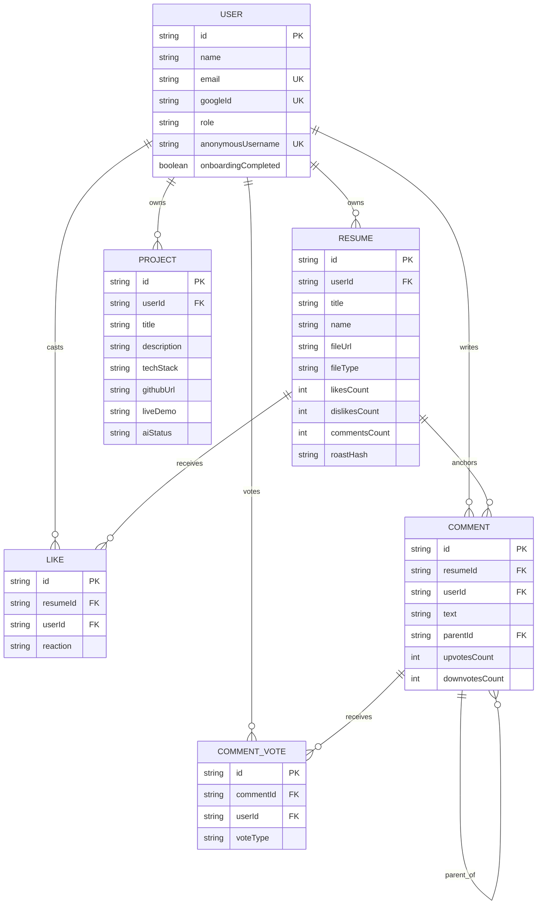
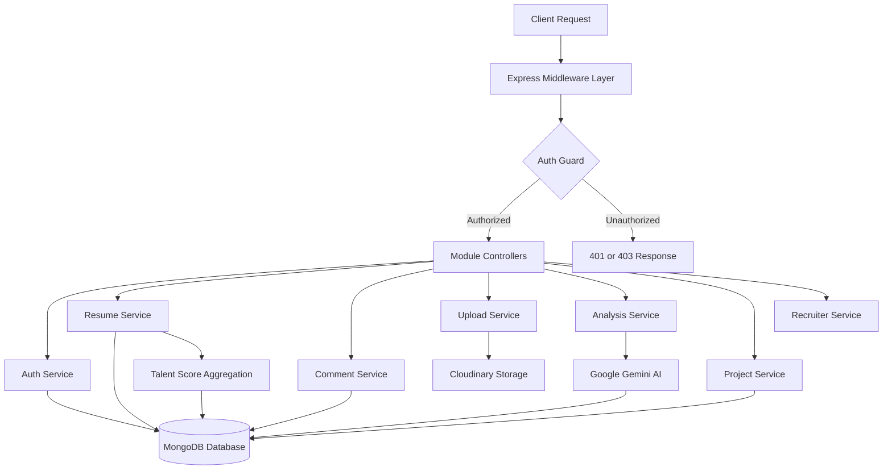
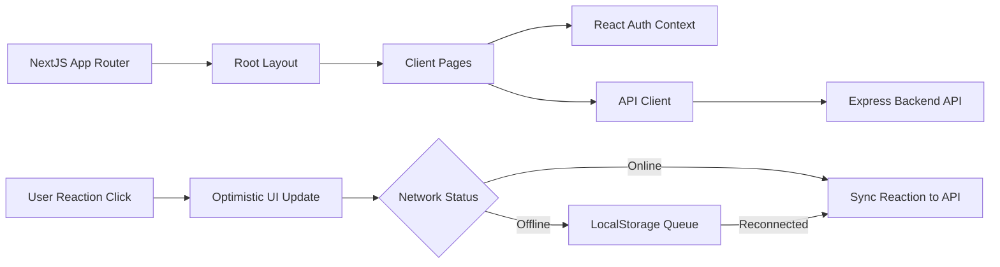

# RoastForge

RoastForge is a full-stack web application where developers upload resumes (and side projects), receive AI-powered “roasts” and structured evaluations, and get feedback from the community through comments, upvotes/downvotes, and like/dislike reactions. Recruiters get a dedicated workflow to discover candidates based on target roles, skills, and derived composite talent scores.

The stack is built with Express 5 + TypeScript + MongoDB on the backend and Next.js App Router + Tailwind on the frontend.

## Monorepo Layout

- **[backend](backend)** — Express 5 + TypeScript API, Mongoose, Google OAuth / JWT cookies, Cloudinary uploads, Upstash Redis rate limiting, and Google GenAI (Gemini) for analysis and PII detection.
- **[frontend](frontend)** — Next.js App Router (React 19, Tailwind CSS v4, Framer Motion), MuPDF + pdf-lib for client-side PDF inspection, shared UI primitives, and a central API client.

---

## Architecture

Below are the interactive **Mermaid diagrams** representing the system data model, backend API pipeline, and frontend application pipeline.

### Data Model

Resumes sit at the core: each resume belongs to a user, collects reactions (`likes` collection—one row per viewer per resume with `reaction: "like" | "dislike"`), and anchors threaded comments and comment votes. Projects provide a parallel portfolio track for the same user. The user document holds a **derived** `talentMetrics.composite` score recomputed whenever resumes or reactions are modified.

#### Entity Relationship Diagram



---

### Backend Pipeline

Requests flow into Express, through security headers (`helmet`), CORS, body parsing, and cookie middleware before hitting router modules. Controllers remain thin while services enforce business logic (reaction toggles, counter consistency, talent score recalculation). 



---

### Frontend Pipeline

The Next.js App Router wraps pages in a root layout providing design system tokens and fonts. Client views interact with the backend using a centralized fetch client with automatic token refresh. Like and dislike controls optimistically update UI counters and queue pending actions in `localStorage` if offline.



---

## Database Schemas & Data Tables

Below are the details for each MongoDB collection managed by Mongoose models in `backend/src/modules/`.

### 1. `users` Collection (`User` Model)

Stores account identity, authentication credentials, recruiter/candidate profiles, custom avatar settings, and aggregated metrics.

| Field Name | Type | Rules / Options | Description |
| :--- | :--- | :--- | :--- |
| `_id` | `ObjectId` | Auto-generated PK | Unique user ID |
| `name` | `String` | Required, trim, 2–50 chars | Display name / full name |
| `email` | `String` | Required, unique, lowercase, trim | User email address |
| `password` | `String` | Min 8 chars, `select: false` | Optional legacy bcrypt password hash |
| `googleId` | `String` | Unique, sparse, `select: false` | Google OAuth subject ID (`sub`) |
| `avatar` | `String` | Default `""` | Avatar image URL |
| `preferredAvatarStyle` | `String` | Enum (`AVATAR_STYLES`), default `null` | DiceBear avatar style identifier |
| `preferredAvatarBackgroundColor` | `String` | Max 20 chars, default `null` | DiceBear background color hex |
| `preferredAvatarFlip` | `Boolean` | Default `false` | Avatar flip state |
| `preferredAvatarRotate` | `Number` | Range 0–360, default `0` | Avatar rotation angle |
| `preferredAvatarRadius` | `Number` | Range 0–50, default `0` | Avatar border radius |
| `preferredAvatarScale` | `Number` | Range 0–200, default `100` | Avatar zoom scale percentage |
| `role` | `String` | Enum `["user", "recruiter"]`, default `"user"` | Role for authorization |
| `anonymousUsername` | `String` | Unique | Auto-generated pseudonymous handle |
| `refreshToken` | `String` | `select: false` | Hashed JWT refresh token |
| `onboardingCompleted` | `Boolean` | Default `true` | Indicates if role selection is completed |
| `publicProfile.displayName` | `String` | Max 100 chars, trim, default `""` | Candidate public display name |
| `publicProfile.linkedInUrl` | `String` | Trim, default `""` | Candidate LinkedIn profile URL |
| `publicProfile.githubUrl` | `String` | Trim, default `""` | Candidate GitHub profile URL |
| `publicProfile.shareIdentityWithRecruiters` | `Boolean` | Default `false` | Whether profile identity is visible to recruiters |
| `publicProfile.targetRole` | `String` | Max 80 chars, trim, default `""` | Target job title (indexed for search) |
| `publicProfile.skills` | `Array<String>` | Max 25 items, max 40 chars/item | Lowercased skills array (indexed for search) |
| `talentMetrics.composite` | `Number` | Default `0` | Calculated talent composite score |
| `createdAt` | `Date` | Timestamp | Account creation date |
| `updatedAt` | `Date` | Timestamp | Account last update date |

---

### 2. `resumes` Collection (`Resume` Model)

Stores resume posts, file links, custom avatar configurations, engagement counters, and AI roast outputs.

| Field Name | Type | Rules / Options | Description |
| :--- | :--- | :--- | :--- |
| `_id` | `ObjectId` | Auto-generated PK | Unique resume ID |
| `userId` | `ObjectId` | Required, ref: `User`, indexed | ID of the owner user |
| `title` | `String` | Required, trim, max 200 chars | Public post title |
| `name` | `String` | Required, trim, max 120 chars | Original filename |
| `blurb` | `String` | Trim, max 2000 chars, default `""` | Post description / roast prompt |
| `fileUrl` | `String` | Required | Cloudinary hosted file URL |
| `fileType` | `String` | Enum `["pdf", "image"]`, required | Upload file type |
| `avatarStyle` | `String` | Enum (`AVATAR_STYLES`), default `null` | Per-resume avatar style |
| `avatarSeed` | `String` | Max 120 chars, default `null` | Per-resume avatar seed |
| `avatarBackgroundColor` | `String` | Max 20 chars, default `null` | Per-resume avatar background color |
| `avatarFlip` | `Boolean` | Default `false` | Per-resume avatar flip |
| `avatarRotate` | `Number` | Range 0–360, default `0` | Per-resume avatar rotation |
| `avatarRadius` | `Number` | Range 0–50, default `0` | Per-resume avatar corner radius |
| `avatarScale` | `Number` | Range 0–200, default `100` | Per-resume avatar zoom scale |
| `likesCount` | `Number` | Default `0` | Total upvotes / likes count |
| `dislikesCount` | `Number` | Default `0` | Total dislikes count |
| `commentsCount` | `Number` | Default `0` | Total comments count |
| `roastHash` | `String` | Default `null` | SHA-256 hash of resume text for caching |
| `aiRoast.score` | `Number` | Range 0–100 | Overall AI evaluation score |
| `aiRoast.roastText` | `String` | Full text | Model's written critique. Stored, but never returned by the API — it is the reasoning that keeps scores discriminating, not UI copy |
| `aiRoast.verdictBars` | `Array<Object>` | `[{ id, label, score (1-5) }]` | Dimensional score breakdown |
| `createdAt` | `Date` | Timestamp, indexed (-1) | Creation date |
| `updatedAt` | `Date` | Timestamp | Last modified date |

---

### 3. `likes` Collection (`Like` Model)

Tracks user reactions (likes/dislikes) on resumes.

| Field Name | Type | Rules / Options | Description |
| :--- | :--- | :--- | :--- |
| `_id` | `ObjectId` | Auto-generated PK | Unique reaction ID |
| `resumeId` | `ObjectId` | Required, ref: `Resume`, indexed | Target resume ID |
| `userId` | `ObjectId` | Required, ref: `User` | Reacting user ID |
| `reaction` | `String` | Enum `["like", "dislike"]`, default `"like"` | Reaction type |
| `createdAt` | `Date` | Timestamp | Timestamp of reaction |
| `updatedAt` | `Date` | Timestamp | Reaction update timestamp |

> **Unique Index**: `(resumeId, userId)` ensures one reaction per user per resume.

---

### 4. `comments` Collection (`Comment` Model)

Stores nested comment trees associated with resumes.

| Field Name | Type | Rules / Options | Description |
| :--- | :--- | :--- | :--- |
| `_id` | `ObjectId` | Auto-generated PK | Unique comment ID |
| `resumeId` | `ObjectId` | Required, ref: `Resume`, indexed | Target resume ID |
| `userId` | `ObjectId` | Ref: `User`, default `null` | Author ID (`null` if account deleted & tombstoned) |
| `text` | `String` | Required, max 2000 chars | Comment body text |
| `parentId` | `ObjectId` | Ref: `Comment`, default `null`, indexed | Parent comment ID for replies |
| `upvotesCount` | `Number` | Default `0` | Aggregate upvotes count |
| `downvotesCount` | `Number` | Default `0` | Aggregate downvotes count |
| `createdAt` | `Date` | Timestamp, indexed (-1) | Comment timestamp |
| `updatedAt` | `Date` | Timestamp | Comment modification timestamp |

---

### 5. `commentvotes` Collection (`CommentVote` Model)

Tracks upvotes and downvotes on comments.

| Field Name | Type | Rules / Options | Description |
| :--- | :--- | :--- | :--- |
| `_id` | `ObjectId` | Auto-generated PK | Unique vote ID |
| `commentId` | `ObjectId` | Required, ref: `Comment`, indexed | Target comment ID |
| `userId` | `ObjectId` | Required, ref: `User` | Voting user ID |
| `voteType` | `String` | Enum `["upvote", "downvote"]`, required | Vote direction |
| `createdAt` | `Date` | Timestamp | Timestamp |
| `updatedAt` | `Date` | Timestamp | Timestamp |

> **Unique Index**: `(commentId, userId)` prevents duplicate votes by the same user.

---

### 6. `projects` Collection (`Project` Model)

Stores side projects submitted by candidate users along with AI code quality evaluations.

| Field Name | Type | Rules / Options | Description |
| :--- | :--- | :--- | :--- |
| `_id` | `ObjectId` | Auto-generated PK | Unique project ID |
| `userId` | `ObjectId` | Required, ref: `User`, indexed | Owner user ID |
| `title` | `String` | Required, trim, max 200 chars | Project title |
| `description` | `String` | Trim, max 2000 chars, default `""` | Project summary / description |
| `techStack` | `Array<String>` | Trimmed string items | List of technologies used |
| `githubUrl` | `String` | Trim, default `""` | GitHub repository URL |
| `liveDemo` | `String` | Trim, default `""` | Live project URL |
| `aiStatus` | `String` | Enum `["pending", "processing", "done", "failed"]` | AI evaluation processing status |
| `aiEvaluation.codeQuality` | `Number` | Score value | AI code quality score |
| `aiEvaluation.complexity` | `Number` | Score value | AI technical complexity score |
| `aiEvaluation.summary` | `String` | Evaluation text | Detailed AI project feedback |
| `aiEvaluation.extractedSkills` | `Array<String>` | Extracted skill tags | Skills detected by AI |
| `createdAt` | `Date` | Timestamp | Creation timestamp |
| `updatedAt` | `Date` | Timestamp | Modification timestamp |

---

## What’s Implemented

### Backend

- **Google OAuth & JWT Authentication**: Sign in via Google OAuth, HTTP-only refresh tokens in cookies, access tokens, role onboarding (`user` vs `recruiter`).
- **Profile & Identity**: Update public profile (`displayName`, `targetRole`, `skills`, social links), regenerate pseudonymous handle, account deletion with user data cascade purge.
- **Resumes Management**: Resume upload, metadata CRUD, pagination, full-text search, sort tabs, owner-only AI roast visibility.
- **Direct & Proxy Cloudinary Uploads**: Direct signed upload endpoint (`POST /api/upload/sign/resume`) bypassing serverless request body caps, plus legacy server proxy endpoints.
- **Reactions & Counter Atomicity**: `POST /api/resumes/:id/reaction` handling `like` / `dislike` toggling and state switches atomically.
- **Talent Score Aggregation**: Dynamic computation of `User.talentMetrics.composite` from AI scores, net likes, and dislike penalties.
- **Hybrid PII Detection**: Client-side deterministic pattern matching + PDF hyperlink annotation extraction combined with Gemini AI name and location detection (`POST /api/analysis/detect-pii`).
- **AI Roast & Caching**: Resume content analysis powered by Google Gemini with SHA-256 hash caching (`roastHash`).
- **Threaded Comments & Voting**: Nested comment threads, reply chains, upvoting/downvoting, and tombstone preservation (`[deleted by user]`) for deleted accounts/nodes with active subtrees.
- **Side Projects & AI Evaluation**: Side project showcase with optional AI code quality and complexity scoring.
- **Recruiter Candidate Discovery**: Search candidates by target roles, skill tags, and composite talent metrics.
- **Security & Rate Limiting**: Upstash Redis / Express rate limiting, Helmet HTTP headers, CORS origin validation, and MongoDB sanitation.

### Frontend

- **Next.js App Router**: Custom route groups `(roasthub)` for gallery, detail view, candidate profile, upload, projects, recruiter dashboard, and onboarding.
- **Design System & Aesthetics**: Dark/light theme support using CSS custom properties, responsive typography, and Framer Motion micro-animations.
- **Optimistic UI & Offline Queue**: Reaction buttons update counters instantly; failed network requests queue in `localStorage` and sync automatically when online.
- **Interactive PDF PII Redaction Editor**: Local candidate extraction (emails, links, phone numbers, PDF hyperlink annotations) merged with AI-detected name/location markers.
- **Global Auth & State**: React Context API global auth provider (`AuthProvider` / `useAuth`) with automatic token refreshing via central API client.

---

## Project Structure

```text
backend/
├── server.ts
├── env.example
├── src/
│   ├── app.ts
│   ├── common/
│   │   ├── config/
│   │   ├── dto/
│   │   ├── middleware/
│   │   └── utils/
│   └── modules/
│       ├── analysis/
│       ├── auth/
│       ├── comment/
│       ├── project/
│       ├── recruiter/
│       ├── resume/
│       └── upload/

docs/
└── architecture/
    ├── backend-pipeline.png
    ├── data-model.png
    └── frontend-pipeline.png

frontend/
├── src/
│   ├── app/
│   │   └── (roasthub)/
│   ├── components/
│   ├── hooks/
│   ├── lib/
│   └── store/
```

---

## Dependencies

### Backend Runtime
`@google/genai`, `@upstash/ratelimit`, `@upstash/redis`, `bcryptjs`, `cloudinary`, `cookie-parser`, `cors`, `dotenv`, `express`, `express-rate-limit`, `google-auth-library`, `helmet`, `joi`, `jsonwebtoken`, `mongoose`, `multer`, `nanoid`, `pdf-parse`

Source: [backend/package.json](backend/package.json)

### Backend Development
`@types/bcryptjs`, `@types/cookie-parser`, `@types/cors`, `@types/express`, `@types/jsonwebtoken`, `@types/multer`, `@types/node`, `nodemon`, `ts-node`, `tsx`, `typescript`

Source: [backend/package.json](backend/package.json)

### Frontend Runtime
`@base-ui/react`, `@radix-ui/react-avatar`, `@radix-ui/react-dialog`, `@radix-ui/react-dropdown-menu`, `@radix-ui/react-label`, `@radix-ui/react-separator`, `@radix-ui/react-slot`, `@radix-ui/react-tabs`, `@react-oauth/google`, `class-variance-authority`, `clsx`, `framer-motion`, `lucide-react`, `motion`, `mupdf`, `next`, `pdf-lib`, `react`, `react-dom`, `react-icons`, `sonner`, `tailwind-merge`

Source: [frontend/package.json](frontend/package.json)

### Frontend Development
`@tailwindcss/postcss`, `@types/node`, `@types/react`, `@types/react-dom`, `eslint`, `eslint-config-next`, `tailwindcss`, `typescript`

Source: [frontend/package.json](frontend/package.json)

---

## API Routes

### Health
- `GET /health` — API health check

### Auth
- `POST /api/auth/google` — Google OAuth login & token issuance
- `POST /api/auth/refresh` — Refresh access token via HTTP-only cookie
- `POST /api/auth/logout` — Logout user & clear cookies
- `GET /api/auth/me` — Fetch current user profile & metrics
- `PATCH /api/auth/me/profile` — Update candidate public profile details
- `POST /api/auth/me/complete-onboarding` — Complete role selection & onboarding
- `PATCH /api/auth/regenerate-username` — Regenerate random anonymous handle
- `DELETE /api/auth/account` — Delete account with full data cascade purge

### Resumes
- `GET /api/resumes` — List public resumes (supports pagination, search, sorting)
- `GET /api/resumes/my` — List current candidate's uploaded resumes
- `GET /api/resumes/:id` — Fetch resume details & AI roast (if authorized)
- `POST /api/resumes` — Create resume post
- `PUT /api/resumes/:id` — Update resume title, blurb, avatar styling
- `DELETE /api/resumes/:id` — Delete resume & associated reactions/comments
- `POST /api/resumes/:id/like` — Legacy toggle-like endpoint
- `POST /api/resumes/:id/reaction` — Toggle/switch reaction (`{"reaction": "like" | "dislike"}`)

### Comments
- `GET /api/comments/resume/:resumeId` — Get threaded comment tree for a resume
- `POST /api/comments/resume/:resumeId` — Add top-level comment
- `PUT /api/comments/:id` — Update comment text
- `DELETE /api/comments/:id` — Delete comment (or tombstone if replies exist)
- `POST /api/comments/:id/replies` — Post reply to a comment
- `POST /api/comments/:id/vote` — Upvote or downvote a comment

### Upload
- `POST /api/upload/sign/resume` — Generate Cloudinary direct upload signature & parameters
- `POST /api/upload/resume` — Server proxy upload for resume PDF/image
- `POST /api/upload/avatar` — Upload custom user avatar image

### Analysis
- `POST /api/analysis/detect-pii` — Gemini AI personal info detection (name, location)
- `POST /api/analysis/:id` — Trigger or fetch cached Gemini AI resume roast

### Project
- `GET /api/project` — List user's side projects
- `POST /api/project` — Add side project with optional AI evaluation
- `DELETE /api/project/:id` — Delete side project

### Recruiter
- `GET /api/recruiter/candidates` — Search candidates by target role, skills, talent metrics
- `GET /api/recruiter/candidate/:userId/profile` — Fetch candidate profile and public assets

---

## Environment Variables

Template: [backend/env.example](backend/env.example)

### Backend (`backend/.env`)

- `PORT` — API port (default `5000`)
- `NODE_ENV` — Environment (`development` / `production`)
- `MONGODB_URI` — MongoDB connection string
- `JWT_ACCESS_SECRET` / `JWT_REFRESH_SECRET` — Secrets for JWT signing
- `JWT_ACCESS_EXPIRES_IN` / `JWT_REFRESH_EXPIRES_IN` — Token expiration durations
- `CLOUDINARY_CLOUD_NAME` / `CLOUDINARY_API_KEY` / `CLOUDINARY_API_SECRET` — Cloudinary credentials
- `UPSTASH_REDIS_REST_URL` / `UPSTASH_REDIS_REST_TOKEN` — Upstash Redis credentials for rate limiting
- `GOOGLE_AI_KEY` — Google Gemini API key
- `FRONTEND_ORIGIN` — Allowed CORS origin(s)
- `CROSS_SITE_COOKIES` — Enable cross-site cookie settings (`true`/`false`)

### Frontend (`frontend/.env.local`)

- `NEXT_PUBLIC_API_URL` — Origin of backend API (e.g. `http://localhost:5000`)

---

## Local Setup

1. **Backend Dependencies**
   ```bash
   cd backend
   npm install
   ```

2. **Backend Environment**
   Copy `backend/env.example` to `backend/.env` and fill in required secrets.

3. **Run API**
   ```bash
   npm run dev
   ```

4. **Frontend Dependencies**
   ```bash
   cd frontend
   npm install
   ```

5. **Frontend Environment**
   Create `frontend/.env.local`:
   ```env
   NEXT_PUBLIC_API_URL=http://localhost:5000
   ```

6. **Run Frontend**
   ```bash
   npm run dev
   ```

Frontend runs on [http://localhost:3000](http://localhost:3000); API runs on [http://localhost:5000](http://localhost:5000).

---

## Scripts

### Backend
- `npm run dev` — Watch and run with `tsx`
- `npm run build` — Compile TypeScript to `dist/` and copy assets
- `npm run start` — Run compiled `dist/server.js`

### Frontend
- `npm run dev` — Start Next.js development server
- `npm run build` — Build production distribution
- `npm run start` — Run Next.js production server
- `npm run lint` — Execute ESLint check
